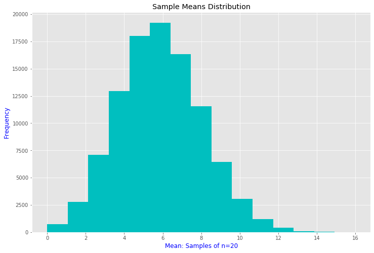

## CENTRAL LIMIT THEOREM

#### Introduction

The central limit theorem states that if you have a population with mean μ and standard deviation σ and take sufficiently large random samples from the population with replacementtext annotation indicator, then the distribution of the sample means will be approximately normally distributed. This will hold true regardless of whether the source population is normal or skewed, provided the sample size is sufficiently large (usually n > 30). If the population is normal, then the theorem holds true even for samples smaller than 30. In fact, this also holds true even if the population is binomial, provided that min(np, n(1-p))> 5, where n is the sample size and p is the probability of success in the population. This means that we can use the normal probability model to quantify uncertainty when making inferences about a population mean based on the sample mean.

#### Central Limit Theorem with a Normal Population

The figure below illustrates a normally distributed characteristic, X, in a population in which the population mean is 75 with a standard deviation of 8.

If we take simple random samples (with replacement)text annotation indicator of size n=10 from the population and compute the mean for each of the samples, the distribution of sample means should be approximately normal according to the Central Limit Theorem. Note that the sample size (n=10) is less than 30, but the source population is normally distributed, so this is not a problem. Note that the horizontal axis is different from the previous illustration, and that the range is narrower.

#### Central Limit Theorem with a Dichotomous Outcome

Suppose we measure a characteristic, X, in a population and that this characteristic is dichotomous (e.g., success of a medical procedure: yes or no) with 30% of the population classified as a success (i.e., p=0.30).

The distribution of sample means based on samples of size n=20 is shown below.

#### Central Limit Theorem with a Skewed Distribution

